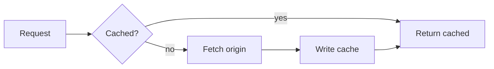
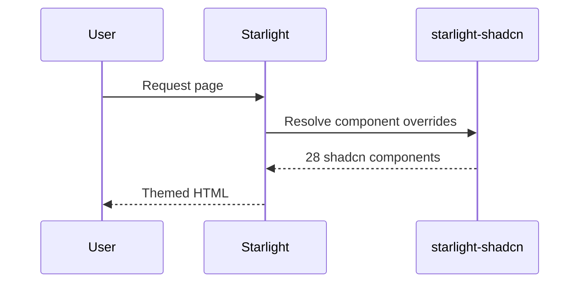

Fence a code block with `mermaid` and the theme renders it as a diagram, using your shadcn tokens for every colour. Toggle light/dark and the diagram re-renders to match.

## Flowchart



## Sequence



## How it works

A remark plugin rewrites the fence into a `<mermaid-diagram>` element before Expressive Code claims it, so the block never becomes a code frame. A custom element then renders it with `mermaid.initialize({ theme: 'base', themeVariables })`, reading `--primary`, `--muted`, `--border` and `--foreground` off the document.

`mermaid` is an **optional** peer dependency. Without it installed, the diagram source stays visible as a plain code block rather than breaking the page. Opt out entirely with:

```js
starlightShadcn({ mermaid: false });
```
